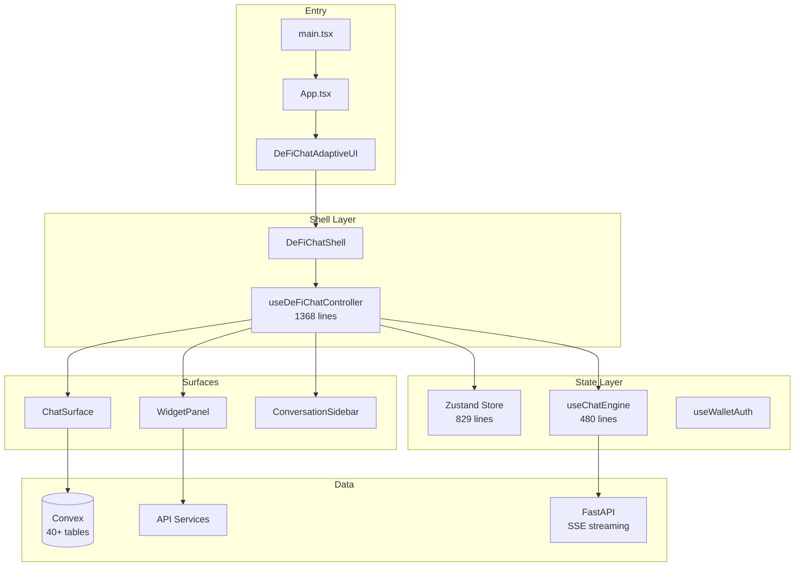

# Frontend Codebase Map

> **Generated**: 2026-02-06 | **Framework**: React 18 + TypeScript 5 + Vite
> **Files**: ~295 | **Tokens**: ~461k

---

## Quick Navigation

| Section | Description |
|---------|-------------|
| [Architecture Overview](#architecture-overview) | System design & provider hierarchy |
| [Convex Backend](#convex-serverless-backend) | 40+ tables, 9 crons, cross-boundary calls |
| [Core UI Components](#core-ui-components) | Shell, chat, widgets, header, sidebar |
| [State Management](#state-management) | Zustand, controller hooks, services |
| [Smart Session Infrastructure](#smart-session-infrastructure) | Rhinestone, Swig, execution signing |
| [Type System](#type-system) | Core TypeScript definitions |

---

## Architecture Overview

### Provider Hierarchy

```
React.StrictMode
  ConvexProvider (real-time backend, VITE_CONVEX_URL)
    QueryClientProvider (React Query, 60s stale time)
      Web3Provider (wagmi + Reown AppKit)
        App
          EntitlementsProvider
            ToastProvider
              DeFiChatAdaptiveUI (page controller)
                DeFiChatShell (layout shell)
```

### Architecture Diagram



### Key Patterns

1. **Shell-Surface**: Single shell orchestrates Chat + Widget Panel + Sidebar
2. **Controller Hook**: `useDeFiChatController` (1368 lines) manages all UI state
3. **Widget Tabs**: Panel widgets shown in tabbed interface, lazy-loaded with Suspense
4. **Real-time Sync**: Convex reactive queries for strategies, sessions, executions
5. **SSE Streaming**: Chat responses via `useChatEngine` with `requestAnimationFrame` batching
6. **Layout rule**: Widget panel wrapper controls layout (flex/hidden), `motion.div` only handles animation

---

## Convex Serverless Backend

### Schema Overview (40+ Tables)

**Users & Auth:**
| Table | Purpose |
|-------|---------|
| `users` | Core user records (EVM/Solana addresses) |
| `wallets` | Multi-wallet per user (address, chain, label, isPrimary) |
| `nonces` | SIWE sign-in challenges (10 min TTL) |
| `sessions` | JWT session tracking (scopes, expiry) |
| `userPreferences` | Portfolio chain preferences |

**Conversations:**
| Table | Purpose |
|-------|---------|
| `conversations` | Chat metadata (walletId, title, archived) |
| `messages` | Chat messages (role: user/assistant/system) |

**Strategies & Execution:**
| Table | Purpose |
|-------|---------|
| `strategies` | Generic strategy framework (6 types, 8 statuses) |
| `strategyExecutions` | State machine tracking (10 states) |
| `dcaStrategies` | DCA-specific config (tokens, frequency, limits) |
| `dcaExecutions` | Individual DCA execution records |
| `agentDecisions` | AI agent audit trail |
| `transactions` | On-chain TX tracking (pending→confirmed→failed) |

**Smart Sessions (Rhinestone ERC-7579):**
| Table | Purpose |
|-------|---------|
| `smartAccounts` | Smart Account deployments (owner, address, chains) |
| `smartSessions` | On-chain session permissions (spending, tokens, actions) |
| `smartSessionIntents` | Intent execution tracking (DCA/swap/bridge) |

**Solana Smart Accounts (Swig):**
| Table | Purpose |
|-------|---------|
| `swigWallets` | Solana smart wallet records |
| `swigSessions` | Role-based Solana permissions |

**Risk & Policy:**
| Table | Purpose |
|-------|---------|
| `riskPolicies` | Per-wallet risk limits (position, slippage, daily) |
| `systemPolicy` | SINGLETON platform controls (emergency stop, blocklists) |
| `feeConfigs` | Paymaster fee asset configuration |

**Token & Chain Data:**
| Table | Purpose |
|-------|---------|
| `tokenCatalog` | Enriched token metadata (sector, stablecoin flags, aliases) |
| `chains` | Dynamic chain registry (14 chains, Alchemy slugs) |
| `portfolioProfiles` | Cached portfolio analysis |

**News & Copy Trading:**
| Table | Purpose |
|-------|---------|
| `newsItems` | Aggregated news with LLM enrichment |
| `newsSources` | RSS/API source config |
| `watchedWallets` | Leader wallet profiles |
| `copyRelationships` | Follower↔Leader config |
| `copyExecutions` | Copy trade execution records |
| `walletActivity` | Parsed wallet events |

**Admin:**
| Table | Purpose |
|-------|---------|
| `admin_users` | Admin accounts (bcrypt, 5 role levels) |
| `admin_sessions` | Admin session tracking |
| `system_config` | Runtime feature flags & settings |
| `system_metrics` | Platform metrics |

### Cron Jobs (9 Scheduled Tasks)

| Job | Frequency | Purpose |
|-----|-----------|---------|
| `checkDCAStrategies` | 1 min | Execute due DCA strategies via FastAPI |
| `checkTriggers` | 1 min | Check generic strategy triggers |
| `fetchNews` | 15 min | Fetch RSS/API news via FastAPI |
| `processNews` | 5 min | LLM news enrichment via FastAPI |
| `cleanupSessions` | 1 hour | Delete expired auth sessions |
| `cleanupNonces` | 15 min | Delete expired sign-in nonces |
| `cleanupSessionKeys` | 1 hour | Mark/delete expired session keys |
| `cleanupRateLimits` | 1 hour | Purge old rate limit records |
| `resetCopyTradingDailyLimits` | Daily 00:00 UTC | Reset daily trade/volume counters |

### Cross-Boundary Calls (Convex → FastAPI)

| Caller | Endpoint | Auth |
|--------|----------|------|
| `scheduler.checkDCAStrategies` | `POST /dca/internal/execute` | `X-Internal-Key` |
| `scheduler.fetchNews` | `POST /news/internal/fetch` | `X-Internal-Key` |
| `scheduler.processNews` | `POST /news/internal/process` | `X-Internal-Key` |
| `scheduler.checkTriggers` | `POST /internal/execute` | `X-Internal-Key` |

### HTTP Routes (FastAPI → Convex)

`http.ts` exposes 6 endpoints for backend to call: `/trigger-execution`, `/update-execution`, `/record-decision`, `/record-transaction`, `/update-transaction`, `/health`

---

## Core UI Components

### Directory Structure

```
src/components/
├── shell/          # DeFiChatShell (209 lines) - main layout orchestrator
├── chat/           # ChatSurface (402 lines), ChatInterface (722 lines)
├── widgets/        # WidgetPanel, WidgetContent, WidgetContents (1754 lines)
├── strategies/     # StrategyActivationFlow (800 lines) - multi-step wizard
├── header/         # HeaderBar (529 lines) - persona, wallet, model indicator
├── sidebar/        # ConversationSidebar (143 lines)
├── panels/         # PanelHost, PanelCard, CardSkeleton (21 files)
├── inline/         # InlineComponentRenderer - Perplexity-style in-chat widgets
├── modals/         # Settings, simulation, swap, bridge modals
├── charts/         # TokenPriceChart
├── ui/             # Primitives (Button, Card, Badge, ResizablePanel)
└── __tests__/      # Render stability tests
```

### Shell & Layout

**`DeFiChatShell.tsx`** (209 lines) - Fully controlled component:
- Desktop: Resizable chat panel (350-600px) + Widget panel (flex-1)
- Mobile: Full-width chat, widgets below
- **Critical**: Widget panel wrapper controls layout via `hidden`/`flex` className; inner `motion.div` only handles opacity/transform animation (prevents AnimatePresence bugs)
- Test: `DeFiChatShell.layout.test.tsx` asserts panel slot is `hidden` when closed

### Chat System

**`ChatSurface.tsx`** (402 lines):
- Markdown rendering with DOMPurify XSS protection
- Source badges with external link indicators
- Action buttons for agent suggestions
- Rotating placeholder examples (6 variations, 4s rotation)
- ARIA live regions, keyboard navigation

**`ChatInterface.tsx`** (722 lines) - Alternative implementation:
- Persona-aware styling (4 persona configs)
- Rich markdown: headers, lists, bold, inline code
- Quick action pills (Portfolio, Trending, Top Coins)

### Widget System

**33 widget types** across 6 categories:

| Category | Widgets |
|----------|---------|
| **Data** (5) | portfolio-summary, token-balance, price-ticker, watchlist, wallet-overview |
| **Chart** (5) | price-chart, portfolio-chart, allocation-pie, pnl-chart, volume-chart |
| **Action** (6) | swap, bridge, send, stake, perps-trade, pending-approvals |
| **Insight** (5) | ai-summary, market-prediction, risk-analysis, opportunity-alert, news-feed |
| **History** (3) | transaction-history, chat-history, activity-log |
| **Utility** (9) | gas-tracker, calculator, notes, quick-links, risk-policy, session-keys, policy-status, dca-strategies, my-strategies |

**Widget Registry** (`src/lib/widget-registry.ts`, 885 lines):
- Metadata: name, description, icon, category, sizes, refresh config
- Factory: `createWidget()`, `duplicateWidget()`, `searchWidgets()`
- Staleness: `isWidgetStale()`, `needsAutoRefresh()`

**Widget Panel Flow:**
```
WidgetPanel → WidgetPanelHeader + WidgetTabs + WidgetContent
  → React.lazy() → Suspense → PanelErrorBoundary → Widget component
```

### Strategy Activation Flow

**`StrategyActivationFlow.tsx`** (800 lines) - 5-step wizard:
1. **Review** - Strategy config + session requirements
2. **Deploy** - Deploy ERC-7579 smart account (if needed)
3. **Grant** - On-chain session grant via Rhinestone SDK
4. **Activate** - Finalize strategy activation
5. **Complete/Error** - Success or retry

### Design System

**`design-system.css`** (818 lines) - "Alpine Precision" theme:
- Typography: Outfit (headings), DM Sans (body), JetBrains Mono (code)
- Dark: `#0a0c10` bg, `#f5a623` accent (electric amber), `#4da6ff` secondary
- Light: `#ffffff` bg, `#d4880f` accent
- Persona themes via `[data-persona="..."]` CSS attribute
- Animations: shimmer, pulse-soft, slide-up/down, typing-dot

---

## State Management

### Zustand Store (`src/store/index.ts`, 829 lines)

8 modular slices:

| Slice | State |
|-------|-------|
| **App** | theme, persona, llmModel, llmProviders, healthStatus |
| **Wallet** | address, chain, isConnected, auth session, entitlement |
| **Chat** | conversationId, messages, isTyping, inputValue |
| **Workspace** | isVisible, widgets, widgetTabs, activeWidgetId, panelWidth |
| **Sidebar** | conversation sidebar state |
| **Settings** | user preferences |
| **UI** | modals, ariaAnnouncement, coachMarkDismissed |
| **Portfolio** | portfolioSummary, collapsedPanels, highlightedWidgets |

Persists to localStorage: theme, persona, chat density, panel layout.

### Key Controller Hooks

| Hook | Lines | Purpose |
|------|-------|---------|
| `useDeFiChatController` | 1368 | Master orchestrator (chat, widgets, signing, modals) |
| `useChatEngine` | 480 | SSE streaming, message management, inline components |
| `useExecutionSigning` | 548 | Strategy execution → quote → sign → confirm |
| `useStrategies` | 410 | DCA strategies CRUD, filters, sorting |
| `useDCASmartSession` | 322 | Bridge between strategies and smart sessions |
| `useSmartSessionGrant` | 253 | On-chain Rhinestone session grant flow |
| `useWalletAuth` | 212 | SIWE/Solana sign-in with deduplication |
| `useRhinestoneAccount` | 206 | Smart account initialize/deploy lifecycle |
| `usePendingApprovals` | 234 | Pending execution approval queue |
| `useShellUIReducer` | 105 | Transient panel UI state (collapse, modals) |

### Services (`src/services/`)

| Service | Purpose |
|---------|---------|
| `api.ts` (277 lines) | Axios client + SSE streaming (`chatStream`) |
| `auth.ts` | SIWE/Solana message builders + verification |
| `rhinestone.ts` | Rhinestone SDK initialization (`kernel` v3.3) |
| `wallet.ts` | Wallet connection, Solana provider detection |
| `prices.ts` | CoinGecko top coins |
| `quotes.ts` | Backend swap quotes |
| `relay.ts` | Relay quote refresh |
| `trending.ts` | CoinGecko trending tokens |

---

## Smart Session Infrastructure

### Wallet State Flow

```
wagmi/AppKit → useWalletSync → Zustand store → useWalletAuth → JWT session
```

### Strategy Activation Flow

```
StrategyActivationFlow
  → useRhinestoneAccount.initialize()     // Deterministic address (no tx)
  → useRhinestoneAccount.deploy(base)     // User signs deploy tx
  → useSmartSessionGrant.grantSession()   // User signs EIP-712 + enable tx
  → useDCASmartSession.recordSessionGrant() // Record in Convex
  → useDCASmartSession.activateWithSession() // Link session → strategy
```

### Execution Signing (Phase 1 Manual Approval)

```
Backend cron creates execution (state: awaiting_approval)
  → User clicks Approve → state: executing
  → useExecutionSigning detects → fetches quote
  → User clicks Sign → checks allowance → sends tx
  → Waits for receipt → marks completed in Convex
```

---

## Type System

### Key Type Files

| File | Purpose |
|------|---------|
| `widget-system.ts` (716 lines) | WidgetCategory, WidgetKind (33 types), WidgetSize, WidgetLifecycleState, WidgetDisplayState, WidgetRefreshConfig, BaseWidgetConfig |
| `widgets.ts` | Simple `Widget<T>` type for panel system (id, kind, title, payload, density) |
| `defi-ui.ts` | AgentMessage, AgentAction, InlineComponent, Panel, PanelSource |
| `chat.ts` | ChatMessage, ChatRequest, ChatResponse |
| `persona.ts` | PersonaId type |
| `portfolio.ts` | PortfolioData structures |
| `entitlement.ts` | Pro gating types |

---

## Build & Configuration

### Scripts

```bash
npm run dev          # Vite dev server (port 5173)
npm run build        # prebuild (lint+typecheck) + vite build
npm run test         # Vitest
npm run typecheck    # tsc --noEmit
npm run workspace:status  # Registry linter
npm run convex:dev   # Convex dev
npm run convex:deploy # Convex deploy
```

### Key Dependencies

- **UI**: React 18, framer-motion, lucide-react, recharts, lightweight-charts
- **State**: zustand, @tanstack/react-query
- **Web3**: wagmi 2.12, viem 2.21, @reown/appkit, @rhinestone/sdk
- **Backend**: convex 1.31, axios
- **DnD**: @dnd-kit/core, @dnd-kit/sortable
- **Security**: isomorphic-dompurify, bcryptjs

### Chains Supported

EVM: Ethereum, Base, Base Sepolia, Arbitrum, Optimism, Polygon, Ink
Non-EVM: Solana

---

## Navigation Guide

**To add a new widget**:
1. Add kind to `WidgetKind` union in `src/types/widget-system.ts`
2. Add metadata to `WIDGET_REGISTRY` in `src/lib/widget-registry.ts`
3. Implement component in `src/components/widgets/`
4. Add lazy import + case to `WidgetContent.tsx`

**To add a Convex table**:
1. Add table definition in `convex/schema.ts`
2. Create query/mutation file in `convex/`
3. Run `npx convex dev` to regenerate types

**To add a new hook**:
1. Create in `src/hooks/` or `src/workspace/hooks/`
2. Follow pattern: Convex queries + local state + exported actions

**To modify auth flow**:
1. Read `docs/WALLET_AUTH_STATE_MACHINE.md` first
2. Modify `src/hooks/useWalletAuth.ts`
3. Update `src/services/auth.ts` for message format changes

**To add a new service**:
1. Create in `src/services/`
2. Add types to `src/types/`
3. Wire into hooks that need it

---

## Gotchas

1. **Layout rule**: Never put `flex-1` on a `motion.div` — AnimatePresence exit leaves element in DOM taking space
2. **Two widget systems**: Widget Panel (store/index.ts, used in prod) vs Widget Store (widget-store.ts, unused grid system)
3. **Signing deduplication**: `useWalletAuth` uses module-level `globalSignInPromise` to prevent duplicate sign-in across HMR remounts
4. **WETH wrapping**: `useDeFiChatController` auto-wraps ETH→WETH if Relay quote requires it
5. **Streaming batching**: `requestAnimationFrame` prevents excessive re-renders during fast SSE streaming
6. **Convex ↔ Backend mismatch**: No shared types — contract tests in `backend/tests/contract/` catch payload format issues
7. **Auto-reconnect disabled**: Users must click "Connect Wallet" — no auto-reconnect on page load
8. **Entitlement**: Only works for EVM wallets (disabled for Solana)

---

*Last updated: 2026-02-06*
