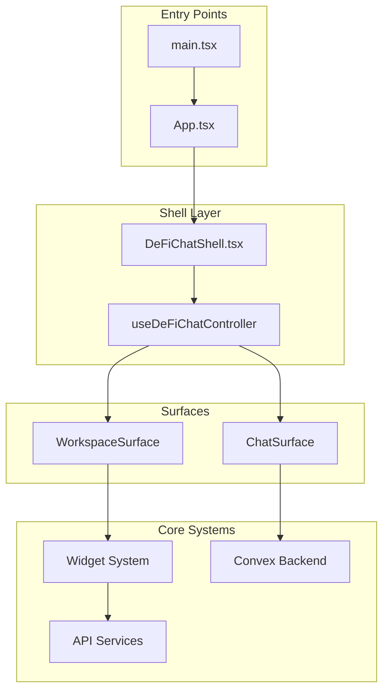
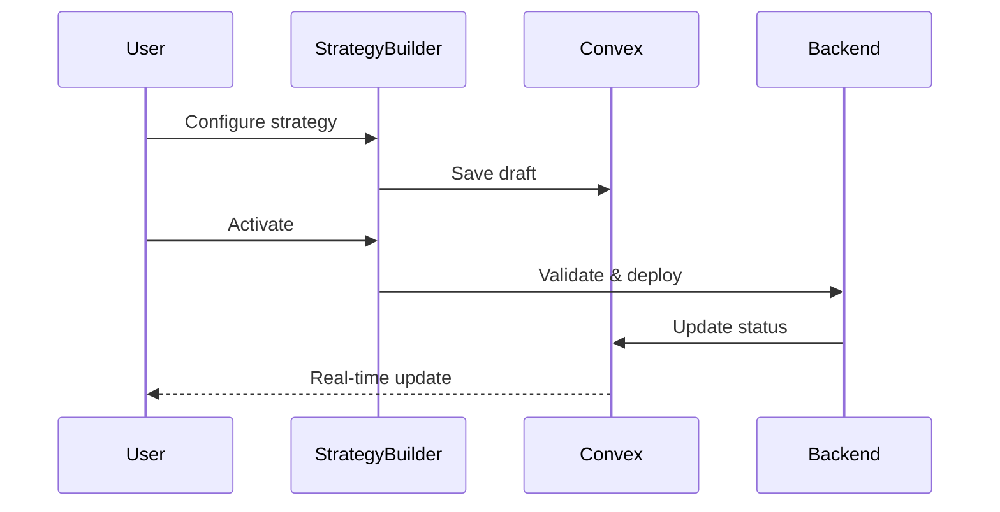
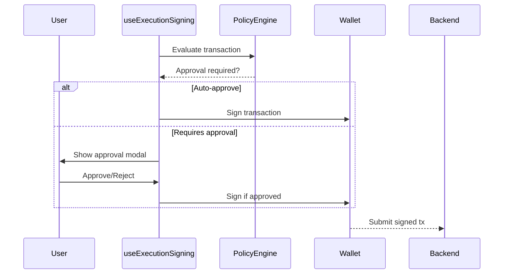
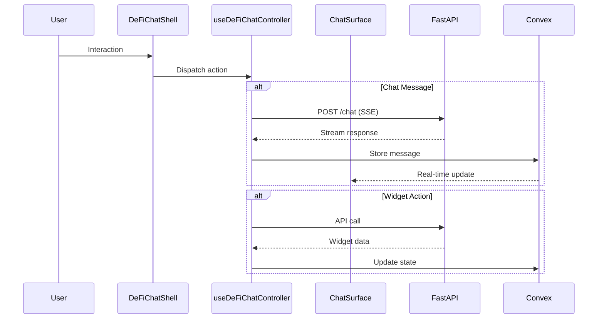

# Frontend Codebase Map

> **Generated**: 2025-01-14 | **Framework**: React 18 + TypeScript 5 + Vite
> **Lines of Code**: ~43,000 | **Files**: ~233

This document provides a comprehensive architectural overview of the Sherpa frontend codebase.

> **⚠️ Architecture Transition (2026-01-27):** The wallet infrastructure is transitioning to Rhinestone Smart Wallets. See `planning/frontend-roadmap.md` Phase 10 for details. Key changes:
> - **Session Keys**: Moving from off-chain (`useSessionKeys`) to on-chain (Smart Sessions via `@rhinestone/sdk`)
> - **Wallet Type**: Adding ERC-7579 Smart Account support alongside EOA
> - **Solana**: Will add Swig smart wallet support (later phase)

---

## Quick Navigation

| Section | Description |
|---------|-------------|
| [Architecture Overview](#architecture-overview) | High-level system design |
| [Convex Backend](#convex-serverless-backend) | Real-time database & functions |
| [Core UI Components](#core-ui-components) | Shell, chat, header, sidebar |
| [Widget System](#widget-system) | Dynamic workspace widgets |
| [Domain Components](#domain-components) | Strategies, policies, execution |
| [State Management](#state-management) | Hooks, stores, services |
| [Type System](#type-system) | Core TypeScript definitions |

---

## Architecture Overview



### Key Architectural Patterns

1. **Shell-Surface Architecture**: Single shell component orchestrates multiple surfaces (Chat/Workspace)
2. **Controller Hook Pattern**: `useDeFiChatController` (1304 lines) manages all UI state
3. **Widget Contract System**: Standardized widget interface for dynamic rendering
4. **Real-time Sync**: Convex provides reactive database queries
5. **SSE Streaming**: Chat responses stream via Server-Sent Events

---

## Convex Serverless Backend

The Convex layer provides real-time database operations and serverless functions.

### Directory Structure

```
convex/
├── schema.ts              # Database schema (40+ tables)
├── conversations.ts       # Conversation CRUD
├── messages.ts           # Message operations
├── wallets.ts            # Wallet management
├── executions.ts         # Trade execution records
├── policies.ts           # Risk policy rules
├── strategies.ts         # Strategy definitions
├── session_keys.ts       # Session key management (⚠️ legacy - see Phase 10)
├── notifications.ts      # User notifications
├── _generated/           # Auto-generated types
└── crons.ts              # 8 scheduled jobs
```

### Schema Overview (40+ Tables)

| Table | Purpose | Key Fields |
|-------|---------|------------|
| `users` | User accounts | `address`, `email`, `createdAt` |
| `conversations` | Chat sessions | `userId`, `title`, `lastMessageAt` |
| `messages` | Chat messages | `conversationId`, `role`, `content`, `widgets` |
| `wallets` | Connected wallets | `userId`, `address`, `chain`, `isPrimary` |
| `strategies` | Trading strategies | `name`, `status`, `conditions`, `actions` |
| `executions` | Execution history | `strategyId`, `status`, `txHash`, `result` |
| `policies` | Risk policies | `name`, `rules`, `priority`, `isActive` |
| `session_keys` | Delegated keys (⚠️ legacy) | `publicKey`, `permissions`, `expiresAt` |
| `notifications` | User alerts | `type`, `title`, `read`, `data` |
| `approvals` | Pending approvals | `type`, `status`, `requestedAt` |

### Cron Jobs (8 Scheduled Tasks)

```typescript
// convex/crons.ts
crons.interval("cleanupExpiredSessions", { hours: 1 }, ...)
crons.interval("processStrategyTriggers", { minutes: 5 }, ...)
crons.interval("updateMarketData", { minutes: 1 }, ...)
crons.interval("sendPendingNotifications", { minutes: 1 }, ...)
crons.interval("cleanupOldMessages", { days: 1 }, ...)
crons.interval("refreshTokenPrices", { minutes: 5 }, ...)
crons.interval("checkStrategyConditions", { minutes: 1 }, ...)
crons.interval("expireOldApprovals", { hours: 1 }, ...)
```

---

## Core UI Components

### Shell & Layout

```
src/components/shell/
├── DeFiChatShell.tsx      # Main shell orchestrator
├── ShellLayout.tsx        # Layout container
└── index.ts
```

**DeFiChatShell.tsx** - Primary application shell that:
- Manages surface switching (Chat ↔ Workspace)
- Provides layout chrome (header, sidebar, footer)
- Handles responsive breakpoints
- Orchestrates keyboard shortcuts

### Chat System

```
src/components/chat/
├── ChatInterface.tsx      # Main chat component (705 lines)
├── MessageBubble.tsx      # Individual messages
├── MessageList.tsx        # Scrollable message container
├── ChatInput.tsx          # Input with suggestions
├── StreamingMessage.tsx   # SSE streaming display
├── QuickActions.tsx       # Suggested prompts
└── TypingIndicator.tsx
```

**ChatInterface.tsx** - Core chat implementation:
- SSE streaming via `useChatEngine` hook
- Message history via Convex
- Widget rendering inline with messages
- Persona-aware styling
- Auto-scroll management

### Header Components

```
src/components/header/
├── Header.tsx             # Main header bar
├── PersonaSelector.tsx    # AI persona dropdown
├── ChainSelector.tsx      # Network switcher
├── WalletButton.tsx       # Connect/disconnect wallet
├── SettingsMenu.tsx       # User preferences
└── SearchBar.tsx          # Global search
```

### Sidebar Components

```
src/components/sidebar/
├── Sidebar.tsx            # Collapsible sidebar
├── ConversationList.tsx   # Chat history list
├── ConversationItem.tsx   # Individual conversation
├── NewChatButton.tsx      # Start new conversation
└── index.ts
```

### Modal System

```
src/components/modals/
├── ModalProvider.tsx      # Global modal context
├── ConfirmModal.tsx       # Confirmation dialogs
├── TransactionModal.tsx   # Transaction preview
├── SettingsModal.tsx      # User settings
└── ApprovalModal.tsx      # Execution approvals
```

### UI Primitives

```
src/components/ui/
├── primitives.tsx         # Base components
├── Button.tsx
├── Card.tsx
├── Badge.tsx
├── Input.tsx
├── Select.tsx
├── Spinner.tsx
├── Skeleton.tsx
├── Tooltip.tsx
└── Toast.tsx
```

---

## Widget System

The widget system provides a dynamic, extensible panel architecture.

### Architecture

```mermaid
graph LR
    subgraph "Widget Flow"
        Backend[Backend Response] --> Parser[Widget Parser]
        Parser --> Registry[Widget Registry]
        Registry --> Renderer[WidgetContents]
        Renderer --> Grid[12-Column Grid]
    end

    subgraph "State"
        Store[Zustand Store]
        DnD[@dnd-kit]
    end

    Grid --> Store
    Grid --> DnD
```

### Directory Structure

```
src/components/widgets/
├── WidgetContents.tsx     # Main renderer (1753 lines)
├── WidgetCard.tsx         # Container wrapper
├── WidgetGrid.tsx         # Grid layout
├── WidgetToolbar.tsx      # Widget actions
├── index.ts               # Barrel export
│
├── portfolio/             # Portfolio widgets
│   ├── PortfolioWidget.tsx
│   ├── PortfolioChart.tsx
│   └── TokenList.tsx
│
├── market/                # Market data widgets
│   ├── PriceTickerWidget.tsx
│   ├── TrendingWidget.tsx
│   └── ChartWidget.tsx
│
├── trading/               # Trading widgets
│   ├── SwapWidget.tsx
│   ├── RelayQuoteWidget.tsx
│   └── BridgeWidget.tsx
│
├── history/               # History widgets
│   ├── HistorySummaryPanel.tsx
│   ├── HistoryTrendCard.tsx
│   └── HistoryComparisonTable.tsx
│
└── defi/                  # DeFi-specific widgets
    ├── YieldWidget.tsx
    ├── LiquidityWidget.tsx
    └── ProtocolWidget.tsx
```

### Widget Types (33 Total)

| Category | Widget Types |
|----------|-------------|
| **Portfolio** | `portfolio`, `token-balance`, `nft-gallery`, `portfolio-chart` |
| **Market** | `price-ticker`, `trending`, `market-chart`, `price-alert` |
| **Trading** | `swap-quote`, `bridge-quote`, `relay-quote`, `limit-order` |
| **DeFi** | `yield-farm`, `liquidity-pool`, `lending`, `staking` |
| **History** | `history-summary`, `history-trend`, `history-comparison`, `tx-list` |
| **Strategy** | `strategy-card`, `strategy-builder`, `backtest-result` |
| **Analysis** | `whale-tracker`, `gas-tracker`, `sentiment`, `news-feed` |
| **Utility** | `calculator`, `converter`, `address-lookup`, `contract-reader` |

### Widget Contract

```typescript
// src/types/widgets.ts
interface Widget {
  id: string;
  type: WidgetType;
  title?: string;
  data: Record<string, unknown>;
  layout?: {
    x: number;
    y: number;
    w: number;  // 1-12 columns
    h: number;  // rows
  };
  actions?: WidgetAction[];
}

interface WidgetAction {
  label: string;
  action: string;
  params?: Record<string, unknown>;
}
```

### Widget Store (Zustand)

```typescript
// src/store/widget-store.ts (751 lines)
interface WidgetStore {
  // State
  widgets: Widget[];
  layout: GridLayout;
  activeWidget: string | null;

  // Actions
  addWidget: (widget: Widget) => void;
  removeWidget: (id: string) => void;
  updateWidget: (id: string, data: Partial<Widget>) => void;
  reorderWidgets: (sourceId: string, targetId: string) => void;

  // Layout
  setLayout: (layout: GridLayout) => void;
  applyPreset: (preset: WorkspacePreset) => void;

  // Persistence
  saveWorkspace: () => void;
  loadWorkspace: () => void;
}
```

### Panel System

```
src/components/panels/
├── PanelHost.tsx          # Panel container
├── PanelCard.tsx          # Individual panel wrapper
├── PanelSkeleton.tsx      # Loading state
├── ExpandedPanelModal.tsx # Full-screen view
└── useQuickActions.ts     # Panel action hooks
```

---

## Domain Components

### Strategies

```
src/components/strategies/
├── StrategiesWidget.tsx       # Main widget (679 lines)
├── StrategyCard.tsx           # Strategy display
├── StrategyBuilder.tsx        # Creation wizard
├── StrategyConditions.tsx     # Trigger configuration
├── StrategyActions.tsx        # Action configuration
├── BacktestResults.tsx        # Historical simulation
└── index.ts
```

**Strategy Data Flow:**


### Risk Policies

```
src/components/policy/
├── PolicyWidget.tsx           # Policy management
├── PolicyEditor.tsx           # Rule editor
├── PolicyRuleCard.tsx         # Individual rule
├── PolicyEvaluator.tsx        # Evaluation display
└── index.ts
```

**Policy Types:**
- **System Policies**: Platform-level guardrails (immutable)
- **Session Policies**: Per-session limits
- **Risk Policies**: User-defined rules

### Session Keys (⚠️ Being Replaced by Rhinestone Smart Sessions)

> **⚠️ Architecture Transition (2026-01-27):** Off-chain session keys are being replaced by on-chain Smart Sessions via Rhinestone. See `planning/frontend-roadmap.md` Phase 10.

```
src/hooks/useSessionKeys.ts    # Session key management (legacy)
```

Session keys enable delegated signing (legacy approach):
- Time-bounded permissions
- Action-specific scopes
- Revocable at any time

**New approach (Phase 10):** Smart Sessions provide on-chain permission enforcement via ERC-7579 modules.

### Execution Signing

```
src/workspace/hooks/useExecutionSigning.ts  # 547 lines
```

**Signing Flow:**


---

## State Management

### Controller Hook

```typescript
// src/hooks/useDeFiChatController.tsx (1304 lines)
```

The main controller orchestrates:
- Surface state (chat/workspace toggle)
- Message handling
- Widget state
- Wallet connection
- Conversation management
- SSE streaming
- Error handling

### Shell Reducer

```typescript
// src/hooks/useShellUIReducer.ts
type ShellAction =
  | { type: 'SET_SURFACE'; surface: 'chat' | 'workspace' }
  | { type: 'SET_SIDEBAR_OPEN'; open: boolean }
  | { type: 'SET_MODAL'; modal: ModalType | null }
  | { type: 'SET_LOADING'; loading: boolean }
  | { type: 'SET_ERROR'; error: string | null };
```

### Custom Hooks

| Hook | Purpose | Lines |
|------|---------|-------|
| `useDeFiChatController` | Main controller | 1304 |
| `useChatEngine` | SSE streaming | ~300 |
| `useConversations` | Conversation CRUD | ~200 |
| `useStrategies` | Strategy management | ~250 |
| `useRiskPolicy` | Policy evaluation | ~150 |
| `useSessionKeys` | Key management (⚠️ legacy) | ~180 |
| `useHistorySummary` | Wallet history | ~200 |
| `useMarketData` | Price/market data | ~150 |
| `useExecutionSigning` | Transaction signing | 547 |

### Zustand Stores

```
src/store/
├── widget-store.ts        # Widget state (751 lines)
└── index.ts               # Store exports
```

### API Services

```
src/services/
├── api.ts                 # Base API client
├── wallet.ts              # Wallet operations
├── prices.ts              # Price fetching
├── trending.ts            # Trending tokens
├── quotes.ts              # Swap/bridge quotes
├── relay.ts               # Relay integration
├── predictions.ts         # Market predictions
├── defi.ts                # DeFi protocols
└── panels.ts              # Panel data
```

---

## Type System

### Core Types

```
src/types/
├── widgets.ts             # Widget definitions
├── widget-system.ts       # System types (716 lines)
├── chat.ts                # Chat/message types
├── strategy.ts            # Strategy types
├── policy.ts              # Policy types
├── portfolio.ts           # Portfolio types
├── history.ts             # History types
├── persona.ts             # AI persona types
├── entitlement.ts         # Pro/free tier
├── defi-ui.ts             # DeFi UI types
└── llm.ts                 # LLM response types
```

### Key Type Definitions

```typescript
// Widget System Types
interface WidgetType =
  | 'portfolio' | 'swap-quote' | 'bridge-quote'
  | 'price-ticker' | 'trending' | 'history-summary'
  | /* ... 27 more */;

// Chat Types
interface Message {
  id: string;
  role: 'user' | 'assistant' | 'system';
  content: string;
  widgets?: Widget[];
  createdAt: number;
}

// Strategy Types
interface Strategy {
  id: string;
  name: string;
  status: 'draft' | 'active' | 'paused' | 'completed';
  conditions: TriggerCondition[];
  actions: StrategyAction[];
}

// Policy Types
interface Policy {
  id: string;
  name: string;
  rules: PolicyRule[];
  priority: number;
  isActive: boolean;
}
```

---

## Workspace System

### Workspace Hooks

```
src/workspace/hooks/
├── usePortfolioSummary.ts     # Portfolio data
├── usePriceTicker.ts          # Live prices
├── useSwapQuote.ts            # Swap quotes
├── useConversationHistory.ts  # Chat history
├── usePendingApprovals.ts     # Approval queue
├── useExecutionSigning.ts     # Signing flow
└── index.ts
```

### Workspace Types

```typescript
// src/workspace/types.ts
interface Workspace {
  id: string;
  name: string;
  layout: GridLayout;
  widgets: Widget[];
  preset?: WorkspacePreset;
}

type WorkspacePreset =
  | 'trading'
  | 'portfolio'
  | 'research'
  | 'minimal';
```

---

## Styling System

### Design Tokens

```
src/styles/
├── tokens.css             # CSS custom properties
├── globals.css            # Global styles
├── components/
│   ├── button.css
│   ├── card.css
│   ├── skeleton.css
│   └── ...
└── themes/
    ├── light.css
    └── dark.css
```

### Token Categories

| Category | Example Tokens |
|----------|---------------|
| Colors | `--color-primary`, `--color-surface`, `--color-text` |
| Spacing | `--space-1` through `--space-12` |
| Typography | `--font-size-sm`, `--font-weight-bold` |
| Borders | `--radius-sm`, `--border-width` |
| Shadows | `--shadow-sm`, `--shadow-lg` |
| Animation | `--duration-fast`, `--ease-out` |

---

## Testing

### Test Structure

```
src/test/
├── setup.ts               # Vitest configuration
├── events.test.ts         # Event system tests
└── history-summary.spec.tsx  # Playwright E2E

src/components/*/__tests__/
├── HistorySummaryPanel.test.tsx
├── HistoryTrendCard.test.tsx
└── ...

src/workspace/hooks/__tests__/
├── usePendingApprovals.test.ts
├── useExecutionSigning.test.ts
└── ...
```

### Testing Stack

- **Unit Tests**: Vitest + React Testing Library
- **E2E Tests**: Playwright
- **Snapshot Tests**: Vitest snapshots for widgets

---

## Build & Development

### Scripts

```bash
npm run dev          # Start Vite dev server
npm run build        # Production build
npm run preview      # Preview production build
npm run lint         # ESLint
npm run typecheck    # TypeScript check
npm run test         # Run Vitest
```

### Environment Variables

```
VITE_API_BASE_URL           # Backend API URL
VITE_WALLETCONNECT_PROJECT_ID  # WalletConnect ID
VITE_CONVEX_URL             # Convex deployment URL
```

---

## Data Flow Summary



---

## Quick Reference

### Important File Locations

| Component | Path |
|-----------|------|
| Main Controller | `src/hooks/useDeFiChatController.tsx` |
| Widget Renderer | `src/components/widgets/WidgetContents.tsx` |
| Widget Store | `src/store/widget-store.ts` |
| Chat Interface | `src/components/chat/ChatInterface.tsx` |
| Convex Schema | `convex/schema.ts` |
| Type Definitions | `src/types/widget-system.ts` |

### Common Patterns

1. **Adding a new widget**: Define type → Add to registry → Implement component → Add to WidgetContents switch
2. **Adding a Convex table**: Update schema → Generate types → Create query/mutation files
3. **Adding a new hook**: Create in `hooks/` → Export from index → Use in components
4. **Adding a new service**: Create in `services/` → Add types → Integrate with hooks

---

*Last updated: 2025-01-14*
